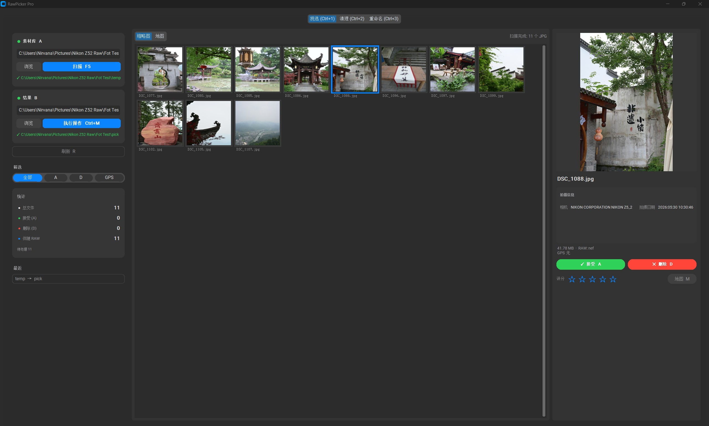
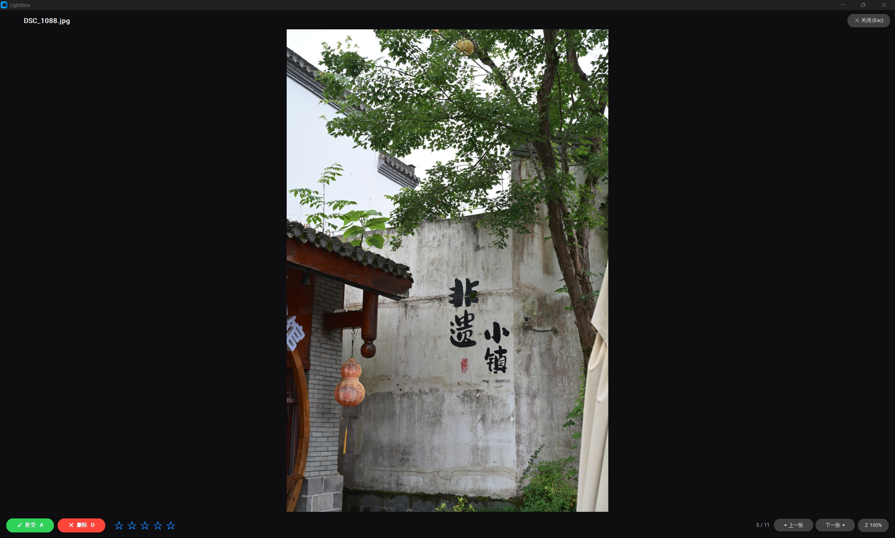

# RawPicker

> 这是一款适合个人工作流的 RAW + JPG 选片与清理桌面工具
> 
> 使用 Python 构建，目前仅支持 Windows
>
> 无任何收费功能，本软件始终开源免费
>
> 如果软件对你有帮助可以点个 Star，或者 [请我喝杯奶茶吗](#可以请我喝杯奶茶吗)
>
> 如果你有什么新的想法或者觉得哪里需要改进
>
> 可以在 Issues 中提出

## 本人的工作流

```
相机导出 JPG + RAW
       │
       ▼
  通过 JPG 选片（JPG＋RAW）
       │
       ├──精选照片──→ RAW后期
       │
       ├──不满意照片──→ 删除JPG和RAW
       │
       └──其余照片──→ 纯旅拍照片保留（全部保留或只保留JPG）
```

## 功能

- **选片工作流** — 扫描文件夹内 JPG，预览全分辨率照片，`A` 标记保留、`D` 标记删除，一键批量移动保留的 JPG（连带 RAW 文件）到目标文件夹，同时删除标记为删除的文件
- **灯箱预览** — 全屏查看器，5 级阶梯式缩放（`Z` 切换适应屏幕 / 100%，缩放倍率 `[0.25×, 0.5×, 1×, 2×, 4×]`），鼠标拖拽平移，键盘翻页（`←` / `→`），侧邻图片预解码实现即切换
- **清理工作流** — 扫描成对文件夹中孤立的 RAW / JPG 文件，预览后删除或移至回收文件夹
- **重命名工作流 （未测试）** — 使用模板批量重命名（`{basename}`, `{seq}`, `{rating}`, `{date}`, `{camera}`）
- **筛选** — 按选择状态（全部 / 保留 / 删除）筛选
- **键盘优先** — 高频操作均有快捷键，减少对鼠标的依赖
- **深色专业主题** — 借鉴 Lightroom / Capture One / Darktable 设计原则的中性灰色调色板，确保长时间编辑不疲劳

## 使用方法

打开软件后，选择需要处理的文件夹：

1. **选片** — 进入选片标签页，`A` 标记保留、`D` 标记删除，`Ctrl+M` 批量移动
2. **灯箱** — 双击缩略图进入全屏灯箱，`Z` 切换缩放模式，`←` `→` 翻页，鼠标拖拽平移
3. **清理** — 在清理标签页扫描成对文件夹，预览孤儿文件后选择删除或移到回收文件夹
4. **重命名** — 在重命名标签页设置模板，批量重命名文件

## 截图

**主界面**



**灯箱预览**



## 快捷键

| 按键 | 功能 | 位置 |
|------|------|------|
| `A` | 标记为保留（再次按取消） | 选片标签 / 灯箱 |
| `D` | 标记为删除（再次按取消） | 选片标签 / 灯箱 |
| `←` `→` | 上一张 / 下一张 | 灯箱 |
| `Z` | 切换缩放（适应屏幕 / 100%） | 灯箱 |
| `Escape` | 关闭灯箱 | 灯箱 |
| `1`–`5` | 设置星级评分 | 选片标签 / 灯箱 |
| `Ctrl+M` | 批量移动保留照片、删除标记照片 | 选片标签 |
| `F5` | 重新扫描文件夹 | 全局 |

## 支持格式

**RAW** — 3FR, ARW, BAY, CR2, CR3, CRW, CS1, DCR, DNG, ERF, FFF, GPR, IIQ, K25, KDC, MDC, MEF, MOS, MRW, NEF, NRW, ORF, PEF, QTK, RAF, RAW, RW2, RWL, RWZ, SR2, SRF, SRW, STI, TIF, TIFF, X3F

**JPG** — JPG, JPEG

## 结尾

> 如果你在使用过程中遇到任何问题
>
> 或者有什么好的建议
>
> 欢迎在 Issues 中提出，本人会在工作之余的时间尽量完善
>
> 感谢您的支持和谅解

## 可以请我喝杯奶茶吗

(´･ω･`)(´･ω･`)(´･ω･`)(´･ω･`)


---

> English version: [readme_en.md](readme_en.md)
